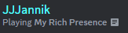
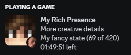
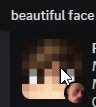
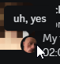
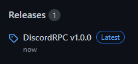

# Discord Rich Presence

I made this small programm, so You can easily configure your own rich presence status. <br>
It's only a cosmetic feature, so it does not provide possibilities to join someone's game/party through the status. <br>

This app uses the [Discord Game SDK Wrapper for Java by JnCrMx.](https://github.com/JnCrMx/discord-game-sdk4j) <br>

## How it could look like

 <br>
 <br>



## How to use?

1. Log into the [Discord Developer Portal](https://discord.com/developers/applications) and create a new application. The name of this application will display then after the "Playing" status.
2. Install [Java *(click)*](https://www.oracle.com/java/technologies/javase/jdk17-archive-downloads.html)
3. Download the DiscordRPC.jar (For more information see: [Download](#download))
4. Put the jar file in a place where you want to and open the terminal there.
   <br>Execute: `java -jar ./DiscordRPC.jar`
5. A .yml file will be created in which the rich presence can be customized. <br>
For the beginning you have to paste you client application id from the [Discord Developer Portal](https://discord.com/developers/applications) into the DiscordRPC.yml config (the key is "applicationId").

### Tips:
1. Instead of saving the application id in the config, you can also use the `-DapplicationId=<id>` parameter when starting the programm the first time. <br>
   This could look then like: `java -jar -DapplicationId=<id> ./DiscordRPC.jar`
2. If you don't really know what to write in the config, you can take a look on the [Discord Developer Portal](https://discord.com/developers/applications) in your application -> Rich Presence -> Visualizer.
3. Unsure what is meant with the timestamps? [This may help you](https://www.unixtimestamp.com/)
4. If you cannot see the rich presence displaying on your profile, try to enable "Display current activity as status message." in the Activity Privacy settings on Discord.

## How to use the assets?

Go to the [Discord Developer Portal](https://discord.com/developers/applications), head over to your application -> Rich Presence -> Art Assets. <br>
Here, you can add your images and have to provide an asset key (by default the name of your asset). <br>
This key is required in the `DiscordRPC.yml`.

## Download

### Download from the newest Release [(*click*)](https://github.com/JJJannik/DiscordRPC/releases)
 
 
### Building from source

To clone the repository:

```shell
git clone https://github.com/JJJannik/DiscordRPC
```

Then open the Terminal in the repo folder and execute:

```
./gradle shadowJar
```

The built Jar will appear in `/build/libs/DiscordRPC.jar`

### Any problems? 
No problem! Either create an issue on this repo or contact me via Discord: JJJannik#3196